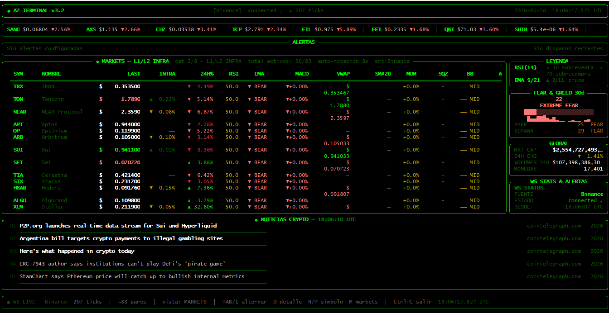
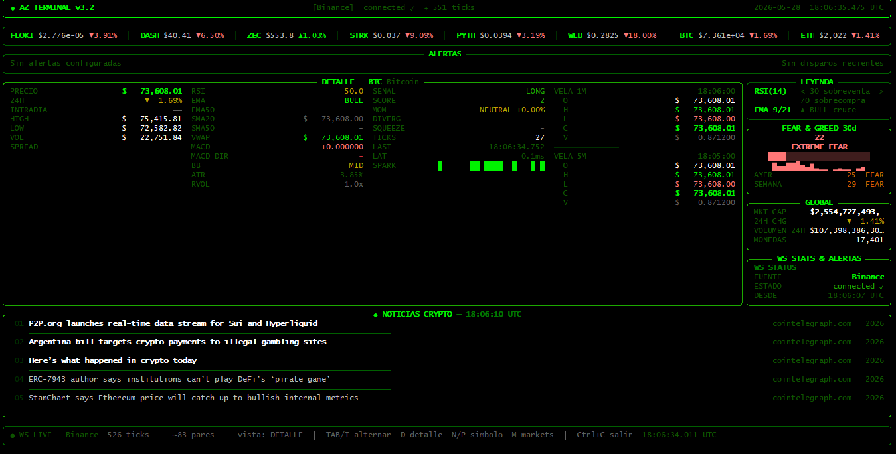
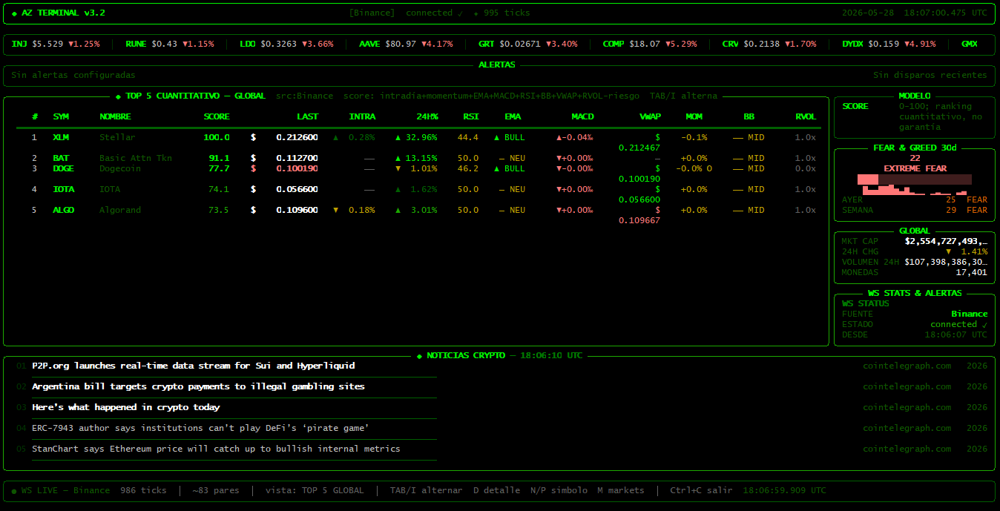

# TerminalCrypt

Real-time cryptocurrency terminal dashboard with WebSocket market feeds, live technical indicators, exchange failover, and a Rich-based TUI.



## Features

- Live WebSocket streams for Binance, Coinbase Advanced Trade, and Kraken.
- Real-time price, volume, candle, spread, and relative-volume state.
- Technical indicators: RSI, EMA cross, MACD, Bollinger Bands, ATR, and combined signal scoring.
- Market dashboard with rotating categories, detail view, Coinbase Top 5 ranking, alerts, news, global stats, and Fear & Greed data.
- Configurable local settings through `terminalcrypt.toml` or `TERMINALCRYPT_` environment variables.
- Optional Telegram surge alerts.
- Optional SQLite tick persistence for local analysis and replay workflows.
- Accelerated indicator backend through Rust, with fallback paths for Cython and pure Python.

## Screenshots





## Requirements

- Python 3.10+
- Rust toolchain when building the accelerated backend
- Windows, macOS, or Linux

## Install

For local development:

```bash
python -m pip install -e .
```

If you want to build the Rust extension wheel:

```bash
python -m pip install maturin
maturin build --release
python -m pip install target/wheels/terminalcrypt-*.whl
```

If the Rust extension is unavailable, TerminalCrypt falls back to the older Cython backend and then to pure Python.

## Usage

Start the live dashboard:

```bash
terminalcrypt
```

Equivalent module entrypoint:

```bash
python -m terminalcrypt
```

Use a specific exchange:

```bash
terminalcrypt --source coinbase
terminalcrypt --source kraken
```

Render a one-time snapshot:

```bash
terminalcrypt --once
```

Create a price alert:

```bash
terminalcrypt --alert BTC 100000
```

Keyboard controls in the live dashboard:

- `TAB` or `I`: switch between Markets and Top 5.
- `M`: return to Markets.
- `D`: open Detail view.
- `N` / `P`: move the selected symbol in Detail view.

## Configuration

Copy the example file and adjust it locally:

```bash
copy terminalcrypt.toml.example terminalcrypt.toml
```

On Linux/macOS:

```bash
cp terminalcrypt.toml.example terminalcrypt.toml
```

Example:

```toml
[terminalcrypt]
source = "binance"
initial_view = "markets"
selected_symbol = "BTC"
refresh_per_second = 2
rest_enabled = true
telegram_enabled = true
sqlite_enabled = false
sqlite_path = "data/terminalcrypt.sqlite3"
sqlite_batch_size = 100
log_file = "logs/terminalcrypt.log"
log_level = "INFO"
fg_interval = 300
global_interval = 120
news_interval = 180
```

Every key can be overridden with an environment variable prefixed with `TERMINALCRYPT_`, for example:

```bash
set TERMINALCRYPT_SOURCE=kraken
```

On Linux/macOS:

```bash
export TERMINALCRYPT_SOURCE=kraken
```

## SQLite Persistence

SQLite persistence is disabled by default. Enable it in `terminalcrypt.toml` when you want to store market ticks locally:

```toml
[terminalcrypt]
sqlite_enabled = true
sqlite_path = "data/terminalcrypt.sqlite3"
sqlite_batch_size = 100
```

The writer runs on a background thread and stores ticks in a `ticks` table with symbol, source, price, 24h stats, bid/ask, spread, volume delta, latency, and UTC timestamp.

## Optional API Keys

CoinGecko requests use `COINGECKO_API_KEY` when it is set:

```bash
set COINGECKO_API_KEY=your_key_here
```

Telegram surge alerts need a bot token and chat id:

```bash
set TELEGRAM_BOT_TOKEN=123456:bot_token_here
set TELEGRAM_CHAT_ID=123456789
```

Optional Telegram tuning:

```bash
set SURGE_ALERT_PCT=3
set SURGE_ALERT_WINDOW=12
set SURGE_ALERT_24H_PCT=8
set SURGE_ALERT_COOLDOWN=900
```

Defaults send one alert per symbol every 15 minutes when price rises at least 3% over the last 12 ticks, or when 24h momentum is at least 8% with short-term confirmation.

## Development

Run tests:

```bash
python -m unittest discover -s tests
```

Run Rust checks:

```bash
cargo check
```

Build a source/wheel package:

```bash
python -m pip install build
python -m build
```

## Architecture

```text
WebSocket streams
        |
        v
 MarketState engine
        |
 +-- indicators
 +-- signal scoring
 +-- alerts
 +-- REST market context
 +-- dashboard renderer
        |
        v
     Rich TUI
```

## Roadmap

- Order book depth
- Trade tape
- Configurable layouts
- Portfolio tracking
- Historical candles
- SQLite persistence
- Strategy backtesting
- Plugin system
- Docker image
- Asyncio migration

## Disclaimer

This software is for educational and informational purposes only. It is not financial advice.

## License

MIT
