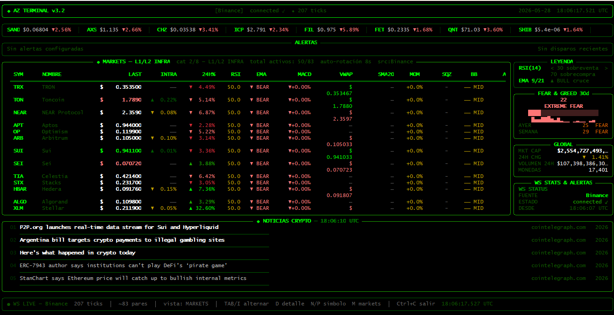
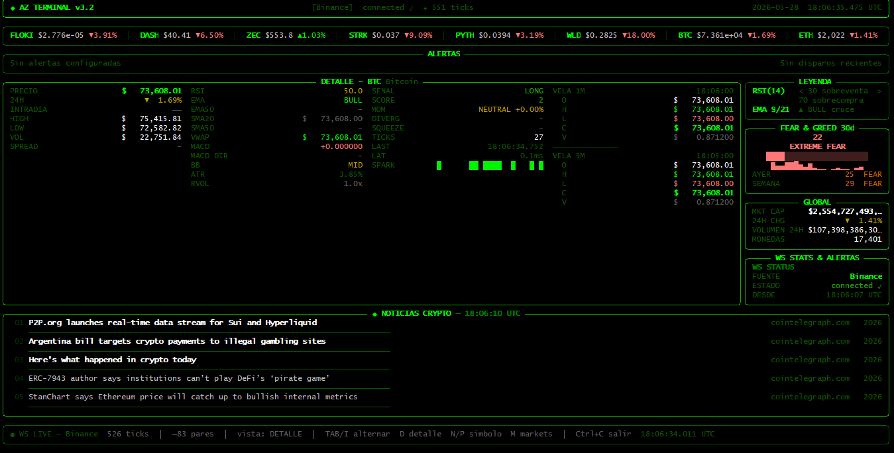
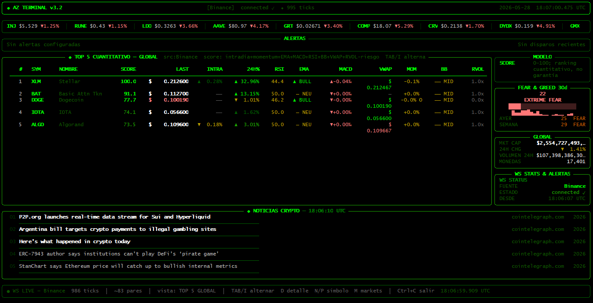

# TerminalCrypt


Real-time cryptocurrency terminal dashboard with WebSocket market feeds, live technical indicators, exchange failover, and a Rich-based TUI.



## Features

- Live WebSocket streams for Binance, Coinbase Advanced Trade, and Kraken.
- Real-time price, volume, candle, spread, and relative-volume state.
- Technical indicators: RSI, EMA cross, MACD, Bollinger Bands, ATR, and combined signal scoring.
- Market dashboard with rotating categories, detail view, Coinbase Top 5 ranking, alerts, news, global stats, and Fear & Greed data.
- Configurable local settings through `terminalcrypt.toml` or `TERMINALCRYPT_` environment variables.
- Optional Telegram surge alerts.
- Optional SQLite tick persistence for local analysis and replay workflows.
- Opportunity Radar: multi-factor setup scanner with conviction scores, reasons, and ATR-based levels.
- Derivatives view: perpetual funding rates, open interest, and a live forced-liquidation feed.
- Whale detection: large prints flagged on the trade tape with aggregate buy/sell pressure.
- Live order book depth ladder and trade tape for the focused symbol.
- Portfolio tracking with live unrealized P&L, and strategy backtesting over historical candles.
- Paper trading with simulated execution: market and limit orders, longs and shorts, fees, slippage, and P&L.
- Historical warm-up so indicators are ready from the first render.
- Accelerated indicator backend through Rust, with fallback paths for Cython and pure Python.

## Screenshots





## Requirements

- Python 3.10+
- Rust toolchain when building the accelerated backend
- Windows, macOS, or Linux

## Install

For local development:

```bash
python -m pip install -e .
```

If you want to build the Rust extension wheel:

```bash
python -m pip install maturin
maturin build --release
python -m pip install target/wheels/terminalcrypt-*.whl
```

If the Rust extension is unavailable, TerminalCrypt falls back to the older Cython backend and then to pure Python.

### Docker

Build and run in a container (a TUI needs an interactive terminal, so pass `-it`):

```bash
docker build -t terminalcrypt .
docker run -it --rm terminalcrypt            # live dashboard
docker run -it --rm terminalcrypt --demo     # synthetic demo, no network
```

Pass any flag after the image name, e.g. `docker run -it --rm terminalcrypt --source kraken`.

## Usage

Start the live dashboard:

```bash
terminalcrypt
```

Equivalent module entrypoint:

```bash
python -m terminalcrypt
```

Use a specific exchange:

```bash
terminalcrypt --source coinbase
terminalcrypt --source kraken
```

Render a one-time snapshot:

```bash
terminalcrypt --once
```

Create a price alert:

```bash
terminalcrypt --alert BTC 100000
```

Backtest the built-in signal over historical candles and exit:

```bash
terminalcrypt --backtest BTC
terminalcrypt --backtest ETH --interval 300 --candles 500
terminalcrypt --backtest SOL --long-only
```

Track a portfolio's live value and unrealized P&L:

```bash
terminalcrypt --portfolio portfolio.json
```

Open the Opportunity Radar (multi-factor setup scanner):

```bash
terminalcrypt --radar
```

Try the whole UI on synthetic data — no network, ideal for a demo or a README GIF:

```bash
terminalcrypt --demo
```

To record the GIF for the README (using [asciinema](https://asciinema.org) and
[agg](https://github.com/asciinema/agg)):

```bash
asciinema rec demo.cast -c "terminalcrypt --demo"
agg demo.cast assets/demo.gif
```

Paper trade with simulated execution against the live feed:

```bash
terminalcrypt --paper
terminalcrypt --paper --paper-cash 25000
terminalcrypt --paper-reset          # reset the account before starting
terminalcrypt --paper-export fills.csv
```

Keyboard controls in the live dashboard:

- `TAB` or `I`: switch between Markets and Top 5.
- `M`: return to Markets.
- `D`: open Detail view (live order book depth + trade tape for the selected symbol).
- `R`: open the Opportunity Radar.
- `F`: open the Derivatives view (funding, open interest, liquidations).
- `W`: open the Portfolio view.
- `T`: open the Paper Trading view.
- `N` / `P`: move the selected symbol.
- `B` / `S` / `C`: paper buy / sell / close the selected symbol (when `--paper` is on).

## Configuration

Copy the example file and adjust it locally:

```bash
copy terminalcrypt.toml.example terminalcrypt.toml
```

On Linux/macOS:

```bash
cp terminalcrypt.toml.example terminalcrypt.toml
```

Example:

```toml
[terminalcrypt]
source = "binance"
initial_view = "markets"
selected_symbol = "BTC"
refresh_per_second = 2
rest_enabled = true
telegram_enabled = true
sqlite_enabled = false
sqlite_path = "data/terminalcrypt.sqlite3"
sqlite_batch_size = 100
log_file = "logs/terminalcrypt.log"
log_level = "INFO"
fg_interval = 300
global_interval = 120
news_interval = 180
warmup_enabled = true
depth_enabled = true
portfolio_file = ""
paper_enabled = false
paper_cash = 10000.0
paper_order_usd = 500.0
```

Every key can be overridden with an environment variable prefixed with `TERMINALCRYPT_`, for example:

```bash
set TERMINALCRYPT_SOURCE=kraken
```

On Linux/macOS:

```bash
export TERMINALCRYPT_SOURCE=kraken
```

## SQLite Persistence

SQLite persistence is disabled by default. Enable it in `terminalcrypt.toml` when you want to store market ticks locally:

```toml
[terminalcrypt]
sqlite_enabled = true
sqlite_path = "data/terminalcrypt.sqlite3"
sqlite_batch_size = 100
```

The writer runs on a background thread and stores ticks in a `ticks` table with symbol, source, price, 24h stats, bid/ask, spread, volume delta, latency, and UTC timestamp.

## Trading Tools

### Opportunity Radar

Press `R` (or run `--radar`) for a full-width scanner that ranks the active
market by a single directional *conviction* score (0-100). Instead of one
dimension, it fuses several confirming factors — a firing volatility squeeze,
relative-volume surge, a fresh EMA 9/21 cross and trend, MACD sign and momentum,
RSI/price divergence, Bollinger reclaim or breakout, and VWAP bias — and prints
the reasons alongside the score. Each setup comes with concrete, ATR-based trade
levels: entry, a `1.5·ATR` stop, and targets at 1R / 2R / 3R with the risk/reward.
It reads the same live indicator engine as the dashboard, so it updates tick by
tick. It is a research and idea-generation tool, not financial advice.

### Derivatives (funding, open interest, liquidations)

Press `F` for the derivatives view, powered by Binance USD-M Futures. It shows
the most extreme **funding rates** (positive = longs pay shorts, a crowded long;
negative = the opposite) with their annualized equivalent, **open interest**
notional, and a **live forced-liquidation feed** — a liquidated long is a forced
sell (bearish), a liquidated short a forced buy (bullish). Funding extremes plus
a liquidation cascade often mark exhaustion or a turn. Toggle with
`derivs_enabled`.

### Whale detection

On the trade tape (Detail view, `D`), prints at or above `whale_usd` (default
$100k) are flagged with 🐋, and quarter-size prints with ★. The tape header shows
the whales' aggregate **buy/sell bias** for the focused symbol, so you can see
when big players are leaning into a move. Tune the threshold with `whale_usd`.

### Order book and trade tape

Press `D` to open the Detail view. A dedicated Binance stream follows the
selected symbol and renders a live depth ladder (top levels with cumulative
size bars) plus a trade tape coloured by aggressor side. `N` / `P` move to the
next / previous symbol and the focused stream re-subscribes automatically.
Disable with `depth_enabled = false`.

### Historical warm-up

At startup the app fetches recent 1m candles for the selected symbol, the mega
caps, and any portfolio holdings so the indicators and signal engine are warm
from the first render. Disable with `warmup_enabled = false`.

### Strategy backtesting

`--backtest SYM` replays the built-in signal engine over historical candles,
walk-forward and without lookahead, and reports strategy return versus buy &
hold, edge, trade count, win rate, average win/loss, max drawdown, an annualized
Sharpe estimate, and market exposure. It is a research tool, not financial advice.

### Portfolio tracking

Create a `portfolio.json` (see `portfolio.example.json`):

```json
{
  "holdings": [
    { "symbol": "BTC", "quantity": 0.35, "cost_basis": 42000 },
    { "symbol": "ETH", "quantity": 4.0,  "cost_basis": 2300 }
  ]
}
```

Run with `--portfolio portfolio.json` (or set `portfolio_file` in the config)
and press `W` for live value, allocation, and unrealized P&L. TOML portfolios
(`[portfolio]` table, Python 3.11+) are also supported.

### Paper trading

Enable with `--paper` (or `paper_enabled = true`) to trade a simulated account
against the live feed. Press `T` for the account view, then:

- `B` / `S`: market buy / sell the selected symbol for `paper_order_usd` of notional.
- `C`: close the selected symbol's position.

The broker supports long and short positions, resting limit orders (filled when
the market crosses the limit), configurable `paper_fee_pct` and
`paper_slippage_pct`, and tracks realized/unrealized P&L plus an equity curve.
The account is persisted to `paper_file` (`paper_account.json` by default) and
survives restarts. `--paper-reset` starts fresh; `--paper-export fills.csv`
writes the fill history to CSV. This is a simulator for practice and strategy
validation — no real orders are ever placed.

## Optional API Keys

CoinGecko requests use `COINGECKO_API_KEY` when it is set:

```bash
set COINGECKO_API_KEY=your_key_here
```

Telegram surge alerts need a bot token and chat id:

```bash
set TELEGRAM_BOT_TOKEN=123456:bot_token_here
set TELEGRAM_CHAT_ID=123456789
```

Optional Telegram tuning:

```bash
set SURGE_ALERT_PCT=3
set SURGE_ALERT_WINDOW=12
set SURGE_ALERT_24H_PCT=8
set SURGE_ALERT_COOLDOWN=900
```

Defaults send one alert per symbol every 15 minutes when price rises at least 3% over the last 12 ticks, or when 24h momentum is at least 8% with short-term confirmation.

## Development

Run tests:

```bash
python -m unittest discover -s tests
```

Run Rust checks:

```bash
cargo check
```

Build a source/wheel package:

```bash
python -m pip install build
python -m build
```

## Performance

The full indicator *bundle* — RSI, EMA cross, MACD, Bollinger, ATR, relative
volume, momentum/squeeze/divergence and the combined signal — runs for every
symbol on every tick. It has three interchangeable backends, selected
automatically at import (Rust → Cython → pure Python).

Measured with `benchmarks/bench_indicators.py` (120-candle window, 20,000
iterations, best of 5) on an AMD Ryzen (Zen 3, 16 threads), Python 3.12,
Windows:

| Backend | Per bundle call | Bundles / sec | Full 80-symbol scan | Speedup |
|---|--:|--:|--:|--:|
| Pure Python | ~626 µs | ~1,600 | ~50 ms | 1.0× |
| **Rust (AVX2 + rayon)** | **~46 µs** | **~21,700** | **~3.7 ms** | **≈13.6×** |

The Rust backend wins for three reasons: it skips the Python interpreter
overhead per call, it computes the eight sub-indicators in parallel with
[rayon](https://github.com/rayon-rs/rayon), and its `sum` / sum-of-squared-
deviation kernels use hand-written **AVX2** SIMD with a runtime feature check
(`is_x86_feature_detected!("avx2")`) that falls back to a scalar loop on older
CPUs. If the compiled extension is unavailable, the app transparently drops to
the Cython backend and then to pure Python — identical results, lower speed.

Numbers are hardware-dependent; reproduce them on your own machine with:

```bash
python benchmarks/bench_indicators.py
```

## Architecture

```text
WebSocket streams
        |
        v
 MarketState engine
        |
 +-- indicators
 +-- signal scoring
 +-- alerts
 +-- REST market context
 +-- dashboard renderer
        |
        v
     Rich TUI
```

## Roadmap

- [x] Order book depth
- [x] Trade tape
- [x] Portfolio tracking
- [x] Historical candles
- [x] SQLite persistence
- [x] Strategy backtesting
- [x] Paper trading with simulated execution
- [x] Opportunity radar (multi-factor scanner)
- [x] Derivatives data (funding, open interest, liquidations)
- [x] Whale / large-trade detection
- [x] Docker image
- [ ] Configurable layouts
- [ ] Plugin system
- [ ] Asyncio migration

## Disclaimer

This software is for educational and informational purposes only. It is not financial advice.

## License

MIT
